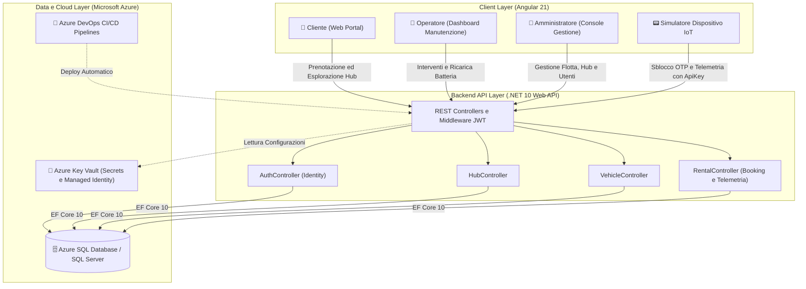
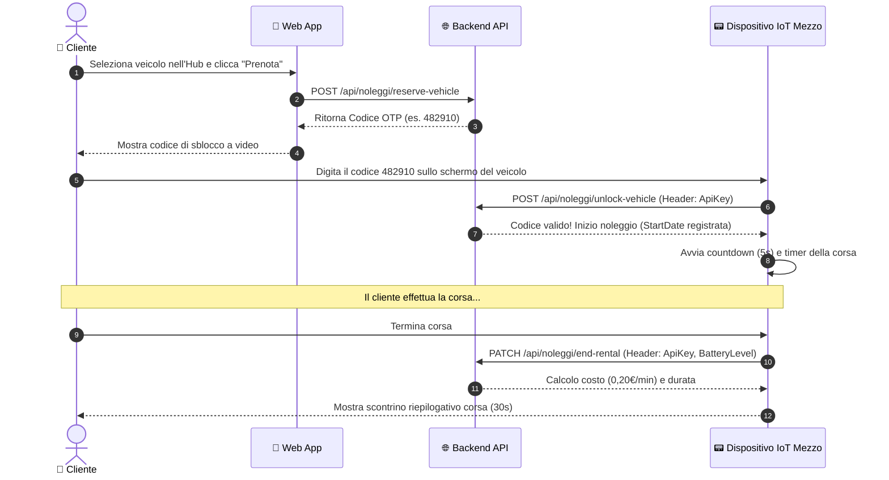

# 🌱 GreenMobility

> **Piattaforma Full-Stack di Sharing Mobility Sostenibile (E-Bike & Monopattini Elettrici) con Simulatore Dispositivo IoT e Cloud Azure**

[](https://dotnet.microsoft.com/)
[](https://angular.dev/)
[](https://learn.microsoft.com/ef/core/)
[](https://azure.microsoft.com/)
[](https://getbootstrap.com/)

---

## 📌 Indice dei Contenuti
- [Panoramica del Progetto](#-panoramica-del-progetto)
- [Architettura del Sistema](#-architettura-del-sistema)
- [Backend (.NET 10 Web API)](#-backend-greenmobility-be)
  - [Caratteristiche & Architettura](#caratteristiche--architettura)
  - [Modello Dati & Database](#modello-dati--database)
  - [Endpoints & Controller](#endpoints--controller)
  - [Sicurezza & Autenticazione](#sicurezza--autenticazione)
  - [Ottimizzazioni SQL & Indici Filtrati](#ottimizzazioni-sql--indici-filtrati)
- [Frontend (Angular 21)](#-frontend-greenmobility-fe)
  - [Caratteristiche & Ruoli Utente](#caratteristiche--ruoli-utente)
  - [Simulatore IoT Veicolo (Onboard Device)](#simulatore-iot-veicolo-onboard-device)
  - [Moduli & Routing](#moduli--routing)
- [Ciclo di Vita del Noleggio (Workflow)](#-ciclo-di-vita-del-noleggio-workflow)
- [Infrastruttura Cloud & DevOps](#-infrastruttura-cloud--devops)
- [Guida all'Avvio Locale](#-guida-allavvio-locale)
  - [Prerequisiti](#prerequisiti)
  - [Configurazione Backend](#configurazione-backend)
  - [Configurazione Frontend](#configurazione-frontend)

---

## 📖 Panoramica del Progetto

**GreenMobility** è una soluzione completa per la mobilità urbana condivisa ed ecologica. Il sistema permette agli utenti di individuare hub territoriali, verificare la disponibilità di mezzi ecologici (**biciclette a pedalata assistita / E-Bike** e **monopattini elettrici**), prenotare un veicolo e sbloccarlo direttamente tramite codice OTP sul dispositivo di bordo.

La piattaforma integra:
1. **Un'API RESTful scalabile in .NET 10** con gestione del database tramite Entity Framework Core, autenticazione JWT e integrazione Azure Key Vault.
2. **Un'applicazione web Angular 21 (SPA)** con interfaccia reattiva e flussi dedicati per **Clienti**, **Operatori di manutenzione** e **Amministratori**.
3. **Un simulatore del dispositivo di bordo (IoT)** in grado di interagire con le API fisiche del veicolo (autenticazione tramite API Key hardware, lettura livello batteria tramite Web Battery API, cronometro corsa e calcolo costi in tempo reale).
4. **Pipeline di CI/CD e deployment su Azure** (App Services, Key Vault con Managed Identity, Azure SQL).

---

## 🏗 Architettura del Sistema



---

## ⚙️ Backend (`GreenMobility-be`)

### Caratteristiche & Architettura
* **Framework**: ASP.NET Core (.NET 10) Web API
* **ORM**: Entity Framework Core 10 (Code-First)
* **Documentazione API**: Scalar (`Scalar.AspNetCore`) & OpenAPI integrati
* **Mapping**: Pattern Mapper personalizzati con Iniezione delle Dipendenze (Scoped)
* **Soft Deletion**: Cancellazione logica per veicoli e hub per preservare lo storico

### Modello Dati & Database

| Entità | Descrizione |
|---|---|
| **`User`** | Estensione di `IdentityUser` con campi aggiuntivi `Name`, `Surname`, soft-delete `IsDeleted`. Ruoli: `Admin`, `Operator`, `Customer`. |
| **`Hub`** | Stazione fisica di parcheggio/ricarica (`Name`, `Address`, `Latitude`, `Longitude`, `MaximumCapacity`, `IsDeleted`). |
| **`Vehicle`** | Mezzo della flotta (`UIC`, `VehicleTypeId`, `VehicleStatusId`, `HubId`, `BatteryLevel`, `ApiKey`, `IsDeleted`). |
| **`Rental`** | Transazione di noleggio (`UserId`, `VehicleId`, `StartDate`, `EndDate`, `RentalCode`, `TotalCost`). |
| **`VehicleType`** | Categoria veicolo: `1` = E-Bike, `2` = Monopattino. |
| **`VehicleStatus`** | Stato operativo: `1` = Disponibile, `2` = In Uso / Prenotato, `3` = In Manutenzione. |

### Endpoints & Controller

#### 1. Autenticazione (`/api/Auth`)
* `POST /api/Auth/Register`: Registrazione cliente (`Roles.CUSTOMER_ROLE`).
* `POST /api/Auth/Login`: Autenticazione con rilascio di token **JWT** (durata: 4 ore).

#### 2. Hub (`/api/hubs`)
* `GET /api/hubs`: Elenco di tutti gli hub attivi.
* `GET /api/hubs/{id}`: Dettaglio hub con lista dei soli veicoli disponibili.
* `POST /api/hubs` *(Solo Admin)*: Creazione nuovo hub con verifica unicità nome.
* `PUT /api/hubs/{id}` *(Solo Admin)*: Modifica informazioni e capienza.
* `DELETE /api/hubs/{id}` *(Solo Admin)*: Soft-delete dell'hub.

#### 3. Veicoli (`/api/vehicles`)
* `GET /api/vehicles` *(Solo Admin)*: Elenco completo flotta con filtri.
* `POST /api/vehicles` *(Solo Admin)*: Creazione veicolo con generazione automatica codice univoco `UIC` (es. `B1...Bn` per biciclette, `M1...Mn` per monopattini), generazione automatica `ApiKey` (GUID) e validazione capienza massima dell'hub.
* `PATCH /api/vehicles/{id}` *(Solo Admin)*: Aggiornamento caratteristiche e stato.
* `DELETE /api/vehicles/{id}` *(Solo Admin)*: Soft-delete veicolo.
* `GET /api/vehicles/maintenance-list` *(Solo Operatore)*: Elenco mezzi con anomalia o batteria scarica ($\le 20\%$).
* `PATCH /api/vehicles/{id}/maintain-vehicle` *(Solo Operatore)*: Ricarica batteria e aggiornamento stato veicolo.

#### 4. Noleggi (`/api/noleggi`)
* `GET /api/noleggi` *(Solo Admin)*: Storico completo di tutti i noleggi effettuati.
* `POST /api/noleggi/reserve-vehicle` *(Solo Customer)*: Prenota un veicolo disponibile e genera un codice OTP monouso di 6 cifre (`RentalCode`). Imposta il veicolo in stato `In Uso` (2).
* `POST /api/noleggi/unlock-vehicle` *(Chiamata Veicolo/IoT - AllowAnonymous)*: Riceve il codice OTP e l'header `ApiKey` (GUID del veicolo). Se validati, avvia il noleggio impostando `StartDate = DateTimeOffset.UtcNow` e invalida il codice monouso.
* `PATCH /api/noleggi/end-rental` *(Chiamata Veicolo/IoT - AllowAnonymous)*: Riceve l'header `ApiKey` e il livello batteria residuo. Calcola la durata effettiva, addebita la tariffa a consumo (**0,20 €/minuto**), imposta `EndDate` e aggiorna lo stato del veicolo.

### Sicurezza & Autenticazione
* **JWT (JSON Web Token)** con validazione automatica di Issuer, Audience e Signing Key.
* **Role-Based Access Control (RBAC)** con autorizzazione differenziata per ruoli `Admin`, `Operator` e `Customer`.
* **Protezione Dati Sensibili**:
  - In ambiente Cloud: Integrazione nativa con **Azure Key Vault** tramite `Azure.Identity.DefaultAzureCredential`.
  - In ambiente Locale: Utilizzo di **.NET User Secrets** (`dotnet user-secrets`), garantendo che nessuna chiave o stringa di connessione venga esposta su GitHub.

### Ottimizzazioni SQL & Indici Filtrati
Il database è progettato per alte prestazioni tramite indici filtrati:
* `IX_Active_Rentals`: Ottimizza le verifiche di noleggi attivi (`[EndDate] IS NULL`).
* `UX_RentalCode`: Garantisce l'unicità dei codici OTP per i noleggi non ancora terminati.
* `IX_Rentals_History_Desc`: Ottimizza le query sullo storico ordini ordinate per data decrescente.
* `IX_Vehicles_Hub_Filter`: Indice composito per velocizzare il filtraggio dei veicoli per Hub, stato e flag di eliminazione.
* `UX_Vehicles_ApiKey`: Indice univoco per autenticare all'istante le chiamate hardware del dispositivo IoT.

---

## 💻 Frontend (`GreenMobility-fe`)

### Caratteristiche & Ruoli Utente
* **Tecnologia**: Angular 21 Standalone Components, RxJS, TypeScript, Bootstrap 5.
* **Autenticazione**: Interceptor HTTP JWT (`jwt.ts`) che inietta automaticamente il bearer token in ogni richiesta autorizzata e gestisce la persistenza della sessione.

#### 1. Portale Cliente (`Customer`)
* **Esplorazione Hub**: Visualizzazione degli hub cittadini con coordinate e disponibilità veicoli.
* **Selezione & Prenotazione Veicolo**: Scelta tra E-Bike e Monopattino in base alla carica della batteria e alle preferenze.
* **Schermata Codice di Sblocco (`rental-code`)**: Presentazione a video del codice PIN OTP di 6 cifre generato dal backend per sbloccare il mezzo.

#### 2. Console Operatore (`Operator`)
* **Dashboard Manutenzione (`/operator/maintenance`)**: Monitoraggio immediato di tutti i veicoli che richiedono attenzione (stato `In Manutenzione` o batteria critica $\le 20\%$).
* **Ricarica & Ripristino**: Possibilità di reimpostare la batteria al 100% e rimettere il veicolo in stato `Disponibile`.

#### 3. Portale Amministratore (`Admin`)
* **Gestione Veicoli (`/admin/vehicles`)**: Aggiunta nuovi mezzi con selezione Hub (con verifica automatica del superamento della capienza massima).
* **Gestione Hub (`/admin/hubs`)**: Monitoraggio e inserimento nuove stazioni con indirizzo, geolocalizzazione e capienza.
* **Gestione Utenti (`/admin/users`)**: Visualizzazione degli account registrati e dei ruoli associati.
* **Storico Noleggi (`/admin/rentals`)**: Tabella riepilogativa globale dei noleggi completati e in corso, con durate e costi fatturati.

---

### 📟 Simulatore IoT Veicolo (Onboard Device)
Una delle caratteristiche più distintive del progetto è il **componente Device** (`/vehicledevice/:apikey` o `/vehicledevice`). Questo componente emula fedelmente lo schermo del computer di bordo montato sul veicolo:

1. **Associazione Hardware (API Key)**:
   - Ogni veicolo ha una chiave univoca (GUID) registrata nel database. Il dispositivo può essere configurato inserendo la chiave manualmente o passandola nell'URL.
2. **Integrazione Sensore Batteria**:
   - Utilizza la **Web Battery API** (`navigator.getBattery()`) per leggere il livello reale della batteria del dispositivo o simulare la scarica progressiva.
3. **Flusso di Sblocco OTP**:
   - Il cliente digita sul tastierino virtuale il codice a 6 cifre generato dalla web app.
   - Il dispositivo invia la richiesta al backend con l'header `ApiKey`.
4. **Viaggio & Cronometro Corsa**:
   - Superata la verifica, parte un conto alla rovescia di 5 secondi prima della partenza ("In sella!").
   - Durante il viaggio viene mostrato il cronometro in tempo reale (ore:minuti:secondi) e lo stato della batteria.
5. **Chiusura Corsa & Scontrino**:
   - Alla terminazione, invia lo stato finale della batteria al backend.
   - Riceve e visualizza il riepilogo finale: **durata effettiva** e **costo calcolato** (0,20 €/min).

---

## 🔄 Ciclo di Vita del Noleggio (Workflow)



---

## ☁️ Infrastruttura Cloud & DevOps

Il progetto è predisposto per un'infrastruttura enterprise su **Microsoft Azure**:
* **Azure App Service (Linux)**: Hosting del Backend API (`wa-be-greenmobility-demo`) e del Frontend.
* **Azure Key Vault (`kv-g4-greenmobility-demo`)**: Custodia sicura delle credenziali JWT e delle stringhe di connessione al database, accessibili tramite **Managed Identity**.
* **Azure SQL Database**: Istanza gestita per i dati di produzione.
* **Azure DevOps Pipelines**:
  - `azure-pipelines.yml`: Pipeline di build, test e deploy continuo per i rami `release/*`.
  - `azure-pipelines-demo.yml`: Pipeline dedicata per l'ambiente demo (`release-demo/*`).

---

## 🚀 Guida all'Avvio Locale

### Prerequisiti
* [.NET 10 SDK](https://dotnet.microsoft.com/download/dotnet/10.0)
* [Node.js](https://nodejs.org/) (v20 o superiore) & npm
* [Angular CLI](https://angular.dev/) (`npm install -g @angular/cli`)
* Un'istanza locale di **SQL Server** / **LocalDB** o accesso ad Azure SQL

---

### 🔧 Configurazione Backend (`GreenMobility-be`)

1. **Clona il repository**:
   ```bash
   git clone https://github.com/SimoSpezia/ProjectWork03-Greenmobility.git
   cd ProjectWork03-Greenmobility/GreenMobility-be
   ```

2. **Configura i User Secrets (Segreti Locali)**:
   Per evitare di committare credenziali sensibili su Git, configura i tuoi segreti locali:
   ```bash
   dotnet user-secrets set "ConnectionStrings:Default" "Server=(localdb)\\mssqllocaldb;Database=GreenMobilityDb;Trusted_Connection=True;MultipleActiveResultSets=true"
   dotnet user-secrets set "JWT:Secret" "LaTuaSuperChiaveSegretaDiAlmeno32Caratteri!"
   dotnet user-secrets set "JWT:ValidIssuer" "https://localhost:7000"
   dotnet user-secrets set "JWT:ValidAudience" "http://localhost:4200"
   ```
   *(In alternativa, se utilizzi Azure Key Vault, inserisci l'endpoint in `KeyVault:Azure:Endpoint`)*.

3. **Applica le migrazioni al Database**:
   ```bash
   dotnet ef database update
   ```

4. **Avvia il server backend**:
   ```bash
   dotnet run
   ```
   L'API sarà raggiungibile e potrai visualizzare la documentazione interattiva su `https://localhost:<porta>/scalar/v1` o Swagger.

---

### 🎨 Configurazione Frontend (`GreenMobility-fe`)

1. **Accedi alla cartella del frontend**:
   ```bash
   cd C:\Users\SpezialeSimone\ITS_J1\GreenMobility-fe
   ```

2. **Installa le dipendenze npm**:
   ```bash
   npm install
   ```

3. **Avvia il server di sviluppo Angular**:
   ```bash
   ng serve
   ```

4. **Apri il browser**:
   Visita l'indirizzo `http://localhost:4200/`. L'applicazione si ricaricherà automaticamente ad ogni modifica del codice.

---

## 👥 Ruoli & Credenziali Demo Consigliate

| Ruolo | Accessi Principali | Utilizzo Tipico |
|---|---|---|
| **Customer** | `/hubs`, `/hubs/:id/vehicles`, `/customer/rental-code` | Ricerca stazioni, prenotazione veicolo e ricezione PIN OTP. |
| **Operator** | `/operator/maintenance` | Monitoraggio batterie scariche, cambio stato mezzi. |
| **Admin** | `/admin/vehicles`, `/admin/hubs`, `/admin/users`, `/admin/rentals` | Gestione totale della flotta, creazione stazioni, report noleggi. |
| **IoT Device** | `/vehicledevice` (o con `/:apikey`) | Interfaccia fisica del veicolo: inserimento codice sblocco, timer corsa. |

---

## 📄 Licenza
Progetto realizzato nell'ambito del percorso formativo ITS - GreenMobility Project Work.
